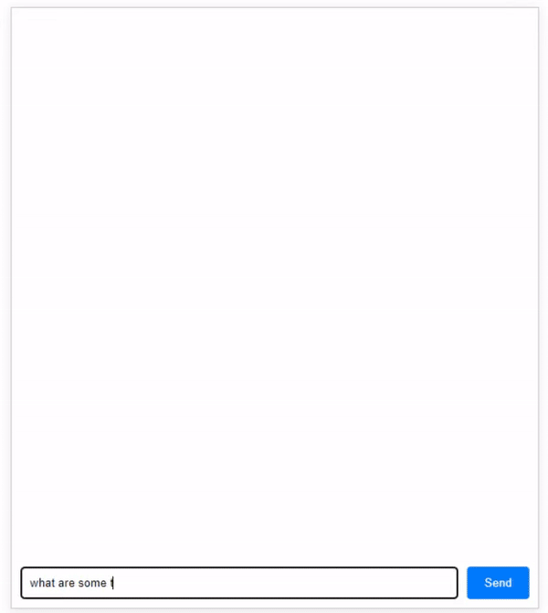

# Streaming LLM Chat

Streaming LLM Chat is a web application built with Flask and OpenAI's GPT-4 models, designed to provide an interactive chat experience using large language models (LLMs).




## Features

- Interactive chat interface with real-time response streaming.
- Integration with OpenAI's GPT-4 for intelligent and coherent responses.
- Simple and easy to set up with minimal configuration required.
- Browser automation for easy access to the chat interface upon starting the application.
- Requires Python 3.10.x

## Installation

To run Streaming LLM Chat on your local machine, follow these steps:

1. Clone the repository:
   ```
   git clone https://github.com/mickymultani/Streaming-LLM-Chat.git
   cd Streaming-LLM-Chat
   ```

2. Create and activate a virtual environment:
   ```
   # For Windows
   python -m venv venv
   .\venv\Scripts\activate

   # For Unix or MacOS
   python3 -m venv venv
   source venv/bin/activate
   ```

3. Install the required packages:
   ```
   pip install -r requirements.txt
   ```

4. Set your OpenAI API key as an environment variable in a `.env` file in the root directory:
   ```
   OPENAI_API_KEY=your_api_key_here
   ```

## Usage

Run the application:
   ```
   python app.py
   ```

The application will start a local server and automatically open the chat interface in your default web browser.

## Contributing

Contributions are welcome! If you have suggestions or contributions to the code, please follow the standard GitHub pull request process to propose your changes.

## License

This project is licensed under the MIT License.
